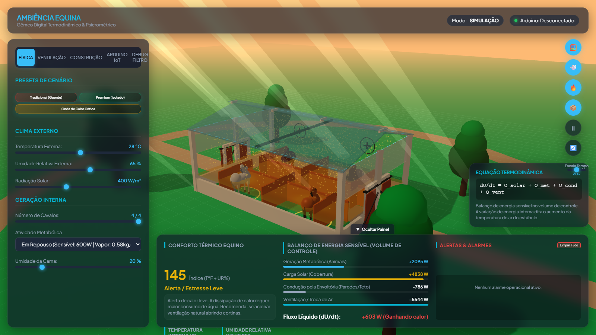

# Simulador de Ambiência Equina · Equine Ambience Simulator

**Gêmeo Digital Termodinâmico e Psicrométrico para Estábulo Equino** — an interactive 3D digital twin of an equine stable that simulates thermal comfort, psychrometrics, ventilation and automation, with real-time connection to an Arduino for hardware-in-the-loop testing.

> **UFR/ICAT — Curso de Engenharia Agrícola e Ambiental**
> **Autores / Authors:** Efraim Almeida Fernandes · Hallison Bittencourt Santos · Geovana Bertoldo de Souza Alves
> **Orientador / Advisor:** Prof. Jofran Luiz de Oliveira



---

## 🇬🇧 English

This project is a **web-based simulator** (TypeScript + Three.js + Vite) of an equine barn:

- **Thermodynamic digital twin** — energy & moisture balance in a control volume (solar load, metabolic heat, conduction, ventilation, evaporation).
- **Psychrometrics** — Tetens saturation pressure, humidity ratio, enthalpy, THI and the equine comfort index (T°F + UR%).
- **3D scene** — animated barn, horses reacting to heat (panting/swearing), spinning fans, airflow particles, thermal heatmap, sun/lighting.
- **Automation** — fan controllers with realistic ramp-up/down, hysteresis control rules, curtains, alarms and energy consumption tracking.
- **Arduino integration** — bidirectional communication via the **Web Serial API** (Chrome/Edge), or a built-in **virtual Arduino mock** that mirrors the firmware logic. Perfect for students to test control firmware without any hardware.

### Why it exists

Students anywhere in the world can use this simulator to:
1. **Test the control logic** of an Arduino-based climate controller — without buying hardware.
2. **Verify firmware behavior** — the `.ino` firmware and the TypeScript mock implement the same hysteresis logic, so you can compare them.
3. **Experiment** with temperature, humidity, solar radiation, horses, bedding moisture, roof insulation and see the thermal response in real time.

### Quick start

Requirements: [Node.js](https://nodejs.org) (v18+).

```bash
npm install
npm run dev        # → http://localhost:5173
```

Production build / preview:

```bash
npm run build      # outputs to dist/
npm run preview    # serves the production build
```

Desktop app (optional, Windows):

```bash
npm run electron:build:dir   # unpacked app
npm run electron:build:msi   # Windows installer (MSI)
```

### Using with a real Arduino

1. Open `ProjetoAmbiencia.ino` in the Arduino IDE and upload it to your board
   (wiring: DHT11 on pin 2, relays on pins 3/4/5).
2. Open the simulator in **Chrome or Edge** (Web Serial API required).
3. Go to the **ARDUINO IoT** tab → select **Arduino Físico (Serial)** → click
   **CONECTAR ARDUINO SERIAL** and pick your board's port.

No hardware? Switch to **Virtual Arduino (Mock)** — it runs the same
hysteresis logic (fans ≥ 28.0 °C, off ≤ 25.0 °C, misting above 30 °C with RH < 80%).

### Project structure

```
src/
├── app.ts          # Main orchestrator (sim + render loop)
├── domain/         # Psychrometric functions (Tetens, THI, equine index)
├── sim/            # Physics engine, control volume, reactive store
├── automation/     # Fan controllers, hysteresis control rules
├── hal/            # IoT manager, Arduino mock, factory
├── iot/            # Message protocol, Web Serial bridge
├── render/         # Three.js scene, barn geometry, horses, fans, particles
├── ui/             # Dashboard, charts, panels
└── analytics/      # Command & alarm logs
ProjetoAmbiencia.ino  # Arduino firmware (C++)
```

---

## 🇧🇷 Português

Projeto de **simulação 3D termodinâmica e psicrométrica de estábulo equino**,
desenvolvido no curso de Engenharia Agrícola e Ambiental da **UFR/ICAT**
(Universidade Federal de Rondonópolis), sob orientação do **Prof. Jofran Luiz de Oliveira**.

O simulador funciona como um **gêmeo digital**: o modelo físico (balanço de
energia e umidade em um volume de controle), o sensoriamento (ruído + filtro EMA),
a automação (histerese, rampas de ventiladores, cortinas) e a visualização 3D
rodam em ciclo contínuo — e podem se conectar a um **Arduino real via Web Serial**
ou a um **mock virtual** que espelha a lógica do firmware.

### Como rodar

```bash
npm install
npm run dev        # → http://localhost:5173
```

### Para testar com Arduino

1. Grave o firmware `ProjetoAmbiencia.ino` na placa (DHT11 no pino 2, relés nos pinos 3/4/5).
2. Abra o simulador no **Chrome ou Edge**.
3. Aba **ARDUINO IoT** → **Arduino Físico (Serial)** → **CONECTAR ARDUINO SERIAL**.

Sem hardware? Use o **Virtual Arduino (Mock)** — mesma lógica de histerese do firmware.

---

## Credits / Créditos

- **Efraim Almeida Fernandes**
- **Hallison Bittencourt Santos**
- **Geovana Bertoldo de Souza Alves**
- **Prof. Jofran Luiz de Oliveira** (orientador) — PhD in Agricultural and Biosystems Engineering (Iowa State University), áreas: Construções Rurais, Ambiência em Instalações Rurais e Bem-Estar Animal.

**Institution:** Universidade Federal de Rondonópolis (UFR) — Instituto de Ciências Agrárias e Tecnológicas (ICAT) — Curso de Engenharia Agrícola e Ambiental.

## License / Licença

Em definição — consulte o mantenedor antes de redistribuir (see `PLANO_GITHUB.md`).
